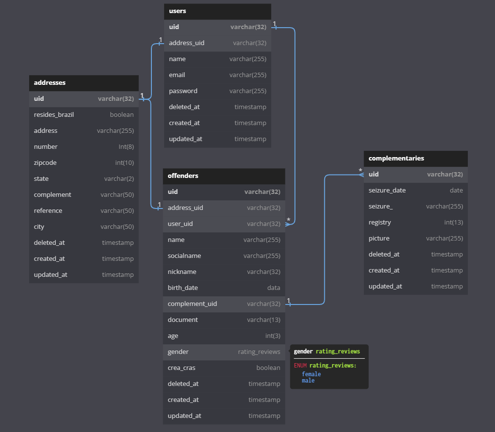

## Installation

```bash
$ yarn
```

## Running the app and database

```bash
# go up the containers
$ docker-compose up -d

# list running containers
$ docker-compose ps

# down the containers
$ docker-compose down
```

## Running the migrates and seeds

```bash
# generated database
$ docker exec -it teen-manager_nestjs yarn prisma generate

# generated entity
$ docker exec -it teen-manager_nestjs yarn prisma migrate dev

# Seeding database
$ docker exec -it teen-manager_nestjs yarn prisma db seed
```

## Prisma studio

```bash
# start prisma studio
$ yarn prisma studio
```

## DER

<p align="center">
  <a target="blank"></a>
</p>
